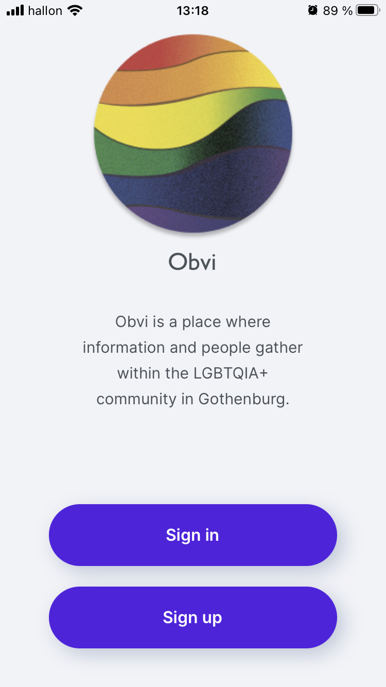

# Obvi

<p align="center">



</p>

## A communication platform for HBTQIA+ as a mobile application 

<!--  -->

This is a mobile application that is built with React Native, Expo and Firebase. The functionalities are to register a user, the ability to create a check-in and get search suggestions close to your location. You can also see other users check-ins on a map and visit their profile page.

### Features

- [x] As a user you are able to create an account.

- [x] As a user you are able to login and logout.

- [x] As a user you are able to check in at a choosen location.

- [x] As a user your are able to see other user's check-ins on a map.

- [x] As a user your are able to visit other user's profiles, and see their recent check-ins.

- [x] As a user your are able to see your own profile, and see your recent check-ins.


## Installation

- Clone the repository

```
$ git clone https://github.com/juljulia/obvi
```

- Install all dependencies

```
$ expo install
```

- From the root of the project, run `expo start` to start a local server for the app.

```
$ expo start
```

- Run the project on a [simulator](https://docs.expo.io/workflow/ios-simulator/) for ios or [emulator](https://docs.expo.io/workflow/android-studio-emulator/) for android. You can also run it from the Expo Client app. Here on [AppStore](https://apps.apple.com/se/app/expo-client/id982107779) or [Google Play](https://play.google.com/store/apps/details?id=host.exp.exponent&hl=en_US&gl=US). You need to create an expo account, then from the Expo app choose the running Obvi project or scan the QR-code from your running local server.

## Authors

- **Emelie Petersson** - [Github](https://github.com/emeliepetersson)
- **Julia Karlsson** - [Github](https://github.com/Juljulia)

## License

This project is licensed under [the MIT License](https://github.com/Juljulia/obvi/blob/master/LICENSE).
